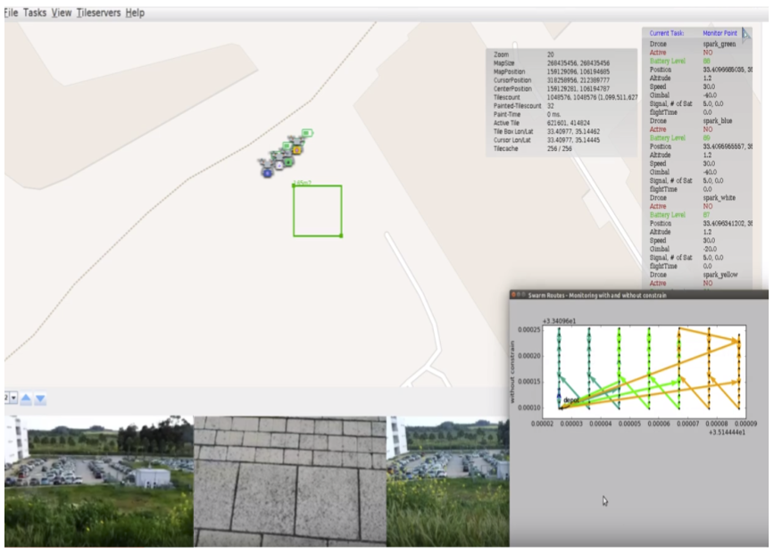

A Unified Framework for Reliable Multi-Drone Tasking in Emergency Response Missions 

A unified framework is presented for coordinated multi-drone tasking in emergency response missions. As elaborated hereafter, response missions consist of a number of distinct tasks that can be assigned among the available agents to expedite the response operations. The proposed framework enables the development and execution of algorithms that jointly schedule and route drone agents across the field to complete their tasks and successfully address the mission goals considering the agent limitations. The key design challenges of implementing the proposed framework are discussed. Finally, initial simulation and experimental results are presented providing evidence of the real life applicability and reliability of the proposed framework.

